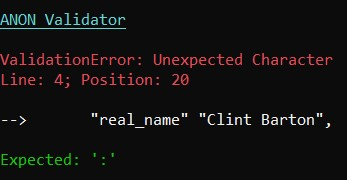

<h1>ANON Validator</h1>

ANON Validator is a tool that can read your .anon files and validate them for errors. It has the capability to point the line number and position of the error to help the user easily fix them. In certain cases it also displays a suggestion which can most probably fix the error.

  
# Steps to run
1. Clone this repository.
2. In the root of the project, run `npm i` to install the dependencies.
3. In the root of the project, run `node index <path_to_file>/file_name.anon` (Eg: `node index test.anon`).

# Screenshot

