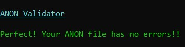
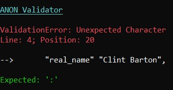
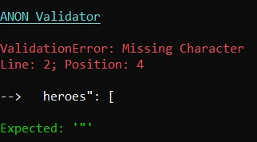
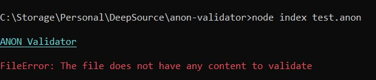
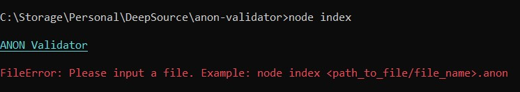
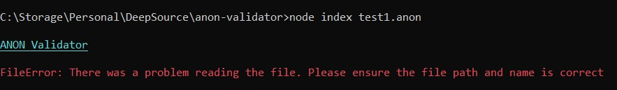
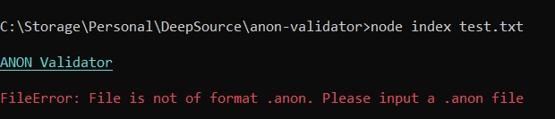
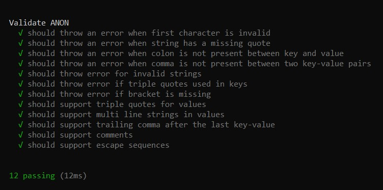

<h1>ANON Validator</h1>

ANON Validator is a tool that can read your .anon files and validate them for errors. It has the capability to print the line number and position of the error to help the user easily fix them. In certain cases, it also displays a suggestion that can most probably fix the error. Since ANON can be considered a superset of JSON with additional functionalities, the tool parses the file character by character following a particular pattern like JSON (with additional features supported in ANON) to determine the correctness of the syntax.

  
# Steps to run
1. Clone this repository.
2. In the root of the project, run `npm i` to install the dependencies.
3. In the root of the project, run `node index <path_to_file>/file_name.anon` (Eg: `node index test.anon`).

# Test execution
After cloning the repository and installing the dependencies, run `npm test` to execute the unit tests.

# Screenshots
**1) No erros during validation**

**2) Error example 1**

**3) Error example 2**

**4) No content in file**

**5) No file provided error**

**6) Wrong file path/name error**

**7) Wrong file format error**

**8) Test execution**

